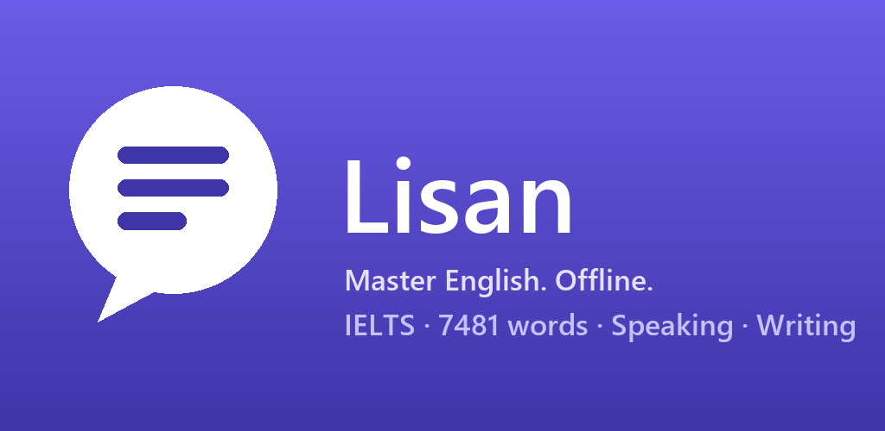
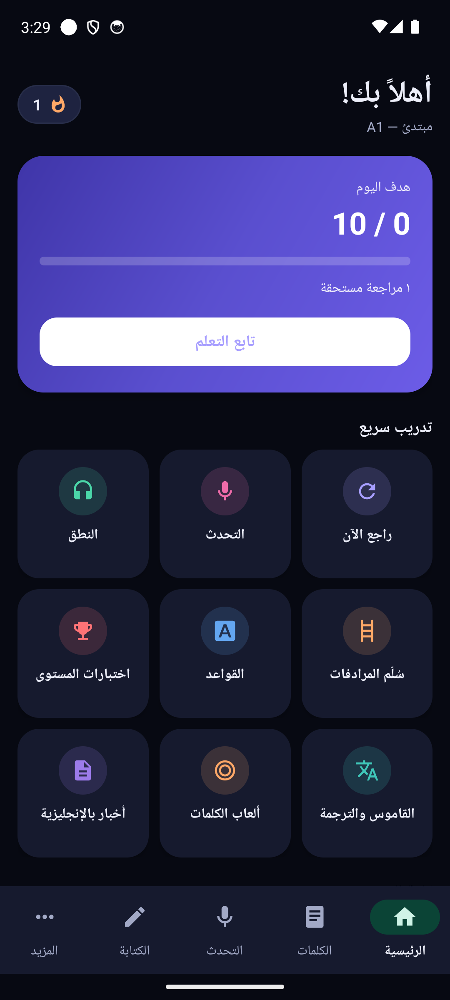
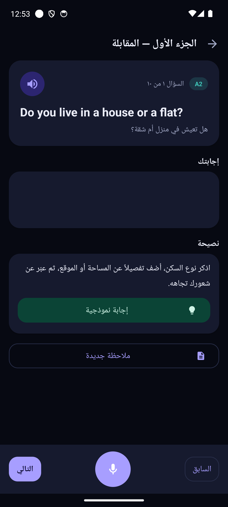
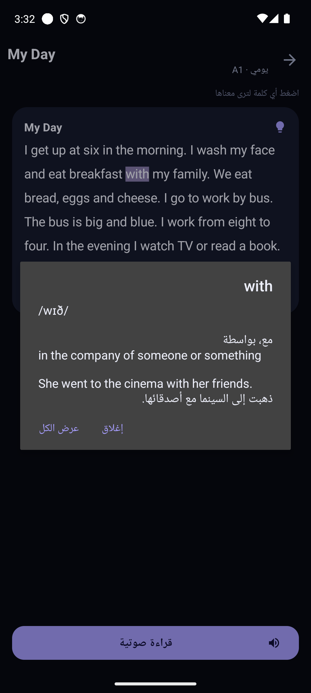

# لسان — Lisan

**تطبيق متكامل لتعلم اللغة الإنجليزية والتحضير للآيلتس — يعمل بالكامل بدون إنترنت**

*A complete English-learning & IELTS-training app for Arabic speakers — fully offline*

---

## ✨ المزايا · Features

| | |
|---|---|
| 🎤 **تدريب آيلتس** | 910 أسئلة محادثة بترجمة عربية + امتحان تجريبي كامل 12 دقيقة بتقرير Band |
| 📚 **7481 كلمة** | من A1 إلى C2 بنطق IPA ومعنى عربي ومثال مترجم وحفظ يومي ذكي |
| 🪜 **سُلّم المرادفات** | 300 معنى بست درجات — ارتقِ من كلمات Band 5 إلى Band 8 |
| 🗣 **نطق واستماع** | استمع وكرر مع تقييم فوري كلمة بكلمة |
| 📖 **قراءة وأخبار** | نصوص متدرجة وأخبار BBC حقيقية — اضغط أي كلمة يظهر معناها |
| ✍️ **كتابة وقواعد** | 72 موضوع آيلتس بمؤقت وتحليل + 107 دروس قواعد بأخطاء العرب الشائعة |
| 🎮 **ألعاب وتعابير** | 4 ألعاب مفردات + 156 فعلًا مركبًا وتعبيرًا اصطلاحيًا |
| 🏆 **أدوات دراسة** | اختبارات مستوى، بنك أخطاء، إنجازات، ويدجت، تذكيرات، نسخ احتياطي |

**بلا إعلانات · بلا حسابات · بلا جمع بيانات · يدعم أندرويد 6 فما فوق**

## 📱 لقطات · Screenshots

  

## ⬇️ التحميل · Download

من صفحة [**الإصدارات · Releases**](../../releases/latest) — حمّل `Lisan-v1.2.apk` وثبّته مباشرة.

> عند ظهور رسالة Play Protect اضغط **Scan app** — التطبيق آمن ولا يجمع أي بيانات ([سياسة الخصوصية](https://kmkholm.github.io/Lisan/privacy.html)).

## 📬 للتواصل · Contact

**د. محمد توفيق · Dr. Mohammed Tawfik**
📧 [kmkhol01@gmail.com](mailto:kmkhol01@gmail.com)

---

© 2026 Dr. Mohammed Tawfik — All rights reserved

